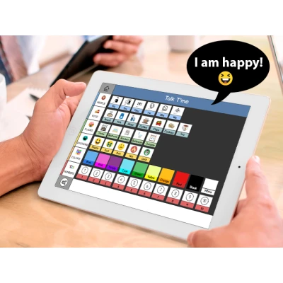

# Talk t’me

## Screenshot

## Overview
Talk t’me was created to give a voice to those who are non-verbal or have any kind of speech delay. This app aims to empower individuals who face challenges in communication by providing them with a platform where they can express themselves effectively.

## Who is this app for
While Talk t’me can be used by anyone, it is particularly designed with the following groups in mind:
- Non-Verbal individuals
- People with speech delay
- Autistic individuals (both children and adults) and their parents

## How does it work
The Talk t’me language system is based on Augmentative and Alternative Communication (AAC) devices. Users can construct sentences using a graphic interface composed of symbols, allowing them to communicate without relying solely on verbal speech. This system enables users to convey their thoughts and needs effectively, even if they struggle with traditional forms of communication.

## Why is this suitable for non-verbal people?
Non-verbal individuals often face challenges in expressing themselves verbally. Talk t’me provides them with a means to communicate using visual symbols, bypassing the need for spoken language. This approach enables non-verbal individuals to overcome communication barriers and engage more fully in social interactions.

## The impact on people's lives
Communication is a fundamental aspect of human interaction. For individuals who are non-verbal or have speech delays, the inability to communicate effectively can significantly impact their daily lives. Talk t’me seeks to address this issue by providing a platform where users can express themselves and connect with others more easily. By empowering individuals with effective communication tools, Talk t’me aims to enhance their overall quality of life.

## Development stages and challenges
### Stage: Prototype / Fully Working Product being tested
Currently, the Talk t’me app is in its final testing phase and is ready to be launched on the App Store. However, several challenges were encountered during the development process, including:
- Creating a promotional campaign video to raise awareness about the app
- Developing a user manual to distribute to organizations and users
- Designing a user-friendly graphic interface that accommodates the needs of diverse users
- Updating the user interface based on feedback and usability testing

## How can you help
You can support the Talk t’me project in the following ways:
- Share this campaign with your friends, family, and network to raise awareness about the app.
- Back this project financially to help cover development and marketing costs.
- If you have programming skills (Swift), consider joining the development team to contribute to the app's ongoing improvement.
- If you have expertise in graphic design, help design an icon pack to enhance the visual appeal of the app.

Together, we can make Talk t’me a valuable tool for individuals who struggle with verbal communication, enabling them to express themselves and connect with others more effectively. Thank you for your support!
